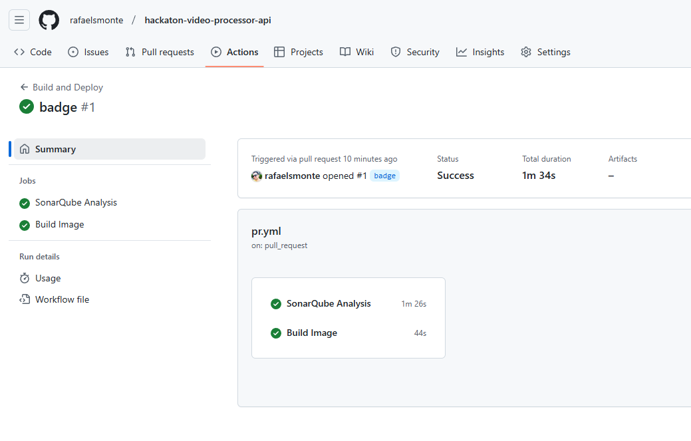

## Hackathon 7SOAT Video Processor API Service - FIAP

This project implements a set of APIs designed to support the business logic of a video image extraction system.

The project architecture utilizes the Express framework with a clean architecture.

This documentation is organized as follows:

- **Service**: Outlines the core business rules and workflows, detailing how the service integrates with other system components.
- **API**: Describes all endpoints, including request formats and response structures.
- **Development**: Provides step-by-step instructions for setting up the development environment and running the project locally.

### Documentation

- [Service](docs/service.md)
- [API](docs/api.md)
- [Development](docs/development.md)
- [CI/CD](docs/ci-cd.md)

### Authors

- _Rafael Santos Monte (RM355045)_
- _Thiago Thalison Firmino de Lima (RM354998)_
- _Vitor Manoel da Silveira (RM355029)_

### Coverage

## Evidences

