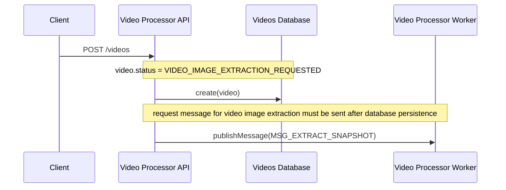
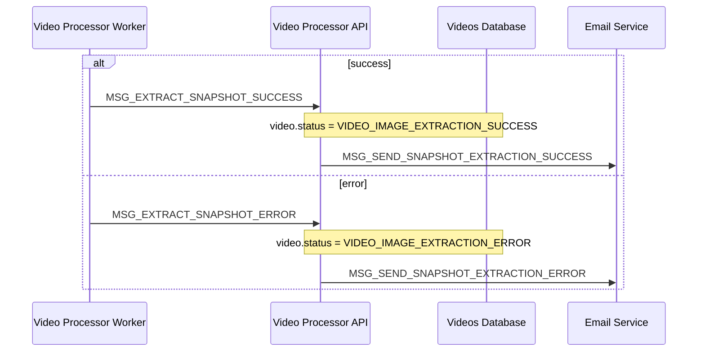

# Hackathon Video Processor API Service

This service receives videos from clients, validates and stores them in an external storage service (**AWS S3**), and communicates with a video processing service via **AWS SNS and SQS** to extract snapshots. This documentation provides a detailed overview of the API’s workflows, validations, and messaging strategies, along with key technical considerations for future improvements.

---

## **File Size Validation Strategy**

To handle video file uploads, we use **Multer**, a middleware for handling multipart/form-data in Node.js. One of its features is file size validation, which we configure to reject videos larger than 5 MB before they are fully processed by our application.

From a **clean architecture perspective**, this approach introduces a slight violation because file size is an entity-level concern—it should ideally be validated within the domain layer, not at the infrastructure (API) level. However, enforcing this restriction at the API layer is a practical necessity due to performance and security concerns.

If we were to validate the file size only at the entity level, the API would first fully receive and load the video into memory before performing the check. This would expose the system to potential risks, such as:

- **Excessive memory consumption**: A large video (e.g., 1 GB) could overwhelm the server before validation occurs;
- **Denial of Service (DoS) risks**: Attackers could exploit this by sending oversized files, causing the application to crash.

By performing the size check early, at the API level, we prevent unnecessary resource consumption and protect the system while still ensuring a proper validation mechanism. This trade-off prioritizes system stability and security over strict adherence to architectural purity.

---

### Upload video



1. The **client** calls the endpoint to upload a new video: [POST /videos](../docs/api.md#postvideos).
2. The **Video Processor API service** receives the video file along with its metadata:
   - `fileName`: The name of the uploaded file.
   - `fileBuffer`: The binary content of the video.
   - `fileMimetype`: The MIME type of the file (must be `video/mp4`).
   - `userId`: The ID of the user uploading the video.
   - `description`: An optional description of the video.
3. Validates the video file using the `VideoFile` entity:
   - Ensures `fileName` is not null or empty;
   - Ensures `fileBuffer` is not null or empty;
   - Ensures `fileMimetype` is `video/mp4`; otherwise, it rejects the upload with an `InvalidVideoFileError`.
4. A unique video name is generated by appending a timestamp to the original file name:

   ```
   {timestamp}-{fileName}
   ```

5. Uploads the video to an external storage service (AWS S3), storing it under the path:

   ```
   {userId}/{timestamped_video_name}
   ```

   - The external storage returns a `videoUrl` pointing to the uploaded video.

6. Creates a new video record in the database using the `Video` entity, initializing the following fields:
   - `id`: Initially empty, assigned by the database.
   - `createdAt`: The current timestamp.
   - `updatedAt`: The current timestamp.
   - `userId`: Identifies the owner of the video.
   - `name`: The generated unique name.
   - `description`: Provided by the user.
   - `url`: The external storage URL of the uploaded video.
   - `snapshotsUrl`: Initially an empty string (`""`), later updated when video extraction is processed.
   - `status`: Set to `VIDEO_IMAGE_EXTRACTION_REQUESTED`.
7. Attempts to publish a video image extraction request message to the **Video Processor Worker** service with the following structure:

```json
{
  "type": "MSG_EXTRACT_SNAPSHOT",
  "sender": "VIDEO_API_SERVICE",
  "target": "VIDEO_IMAGE_PROCESSOR_SERVICE",
  "payload": {
    "videoId": "string", // The id of the video
    "userId": "string" // The id of the user, received from http header by the client request
  }
}
```

8. If the message publication fails:
   - Deletes the newly created video record from the database.
   - The process terminates with an error response.
9. If everything succeeds, responds to the client with the details of the newly created video.

---

### **Retry**

If a video image extraction has failed, the system allows retrying the extraction process under specific conditions.

1. The client calls the endpoint to retry image extraction: [POST /videos/{id}/retry](../docs/api.md#postvideosidretry).
2. The **Video Processor API service** retrieves the video record using the `videoId` and `userId`.
   - If the video does not exist or it does not belong to the requesting user (`userId` does not match), the returns an `VideoNotFoundError` error.
3. Validates whether the video status is `VIDEO_IMAGE_EXTRACTION_ERROR`:
   - If the status **is not** `VIDEO_IMAGE_EXTRACTION_ERROR`, the retry request is rejected with an `InvalidVideoImageExtractionStatusError`.
   - This ensures that only videos with a failed extraction attempt can be retried.
4. If the validation passes, the system publishes a new video image extraction request to the **Video Processor Worker service** with the following structure:

```json
{
  "type": "MSG_EXTRACT_SNAPSHOT",
  "sender": "VIDEO_API_SERVICE",
  "target": "VIDEO_IMAGE_PROCESSOR_SERVICE",
  "payload": {
    "videoId": "string", // The id of the video
    "userId": "string" // The id of the user, received from http header by the client request
  }
}
```

5. Updates the video status in the database:
   - The status changes from `VIDEO_IMAGE_EXTRACTION_ERROR` to `VIDEO_IMAGE_EXTRACTION_REQUESTED`.
6. Returns to the client the updated video details, indicating that the retry process has started successfully.

---

## Video Processor Worker Extraction Response



### **Handling Video Image Extraction Success Message**

When the **Video Processor API service** receives a success message from the **Video Processor Worker service** indicating that the video image extraction has been completed, it updates the video's status and stores the generated snapshots URL.

1. Receives the success message with the following structure:

```json
{
  "type": "MSG_EXTRACT_SNAPSHOT_SUCCESS",
  "sender": "VIDEO_IMAGE_PROCESSOR_SERVICE",
  "target": "VIDEO_API_SERVICE",
  "payload": {
    "videoId": "string", // The id of the video
    "userId": "string", // The id of the user, that represents the video's owner
    "videoSnapshotsUrl": "string" // The URL that points to the extracted video images location on external storage service (AWS S3)
  }
}
```

2. Retrieves the video record using the `videoId` and `userId`.
   - If the video **does not exist**, an error (`VideoNotFoundError`) is raised, preventing further processing.
3. The video status is updated to `VIDEO_IMAGE_EXCTRACTION_SUCCESS`, indicating that the image extraction has been successfully completed.
4. The `videoSnapshotsUrl` received in the message is stored in the video entity. This URL provides access to the extracted snapshots.
5. Publishes a message to the **Email Service** about the successful extraction with the following structure:

```json
{
  "type": "MSG_SEND_SNAPSHOT_EXTRACTION_SUCCESS",
  "sender": "VIDEO_API_SERVICE",
  "target": "EMAIL_SERVICE",
  "payload": {
    "userId": "string", // The id of the user, that represents the video's owner
    "videoUrl": "string", // The URL that points to the original video location on external storage service (AWS S3)
    "videoDescription": "string", // The video's friendly name given by the user
    "videoSnapshotsUrl": "string" // The URL that points to the extracted video images location on external storage service (AWS S3)
  }
}
```

6. Persists the new status and snapshots URL in the database;
   - This ensures that future queries return the latest video processing status.

---

### **Handling Video Image Extraction Error Message**

When the system receives an error message indicating that the video image extraction has failed, it updates the video status accordingly and notifies other services.

1. Receives the error message with the following structure:

```json
{
  "type": "MSG_EXTRACT_SNAPSHOT_ERROR",
  "sender": "VIDEO_IMAGE_PROCESSOR_SERVICE",
  "target": "VIDEO_API_SERVICE",
  "payload": {
    "videoId": "string", // The id of the video
    "userId": "string", // The id of the user, that represents the video's owner
    "errorMessage": "string",
    "errorDescription": "string"
  }
}
```

2. Retrieves the video record using the `videoId` and `userId`.
   - If the video **does not exist**, an error (`VideoNotFoundError`) is raised, preventing further processing.
3. The video status is updated to `VIDEO_IMAGE_EXTRACTION_ERROR`, indicating that an error occurred during processing.

4. Publishes a message to the **Email Service** about the failure with the following structure:

```json
{
  "type": "MSG_SEND_SNAPSHOT_EXTRACTION_ERROR",
  "sender": "VIDEO_API_SERVICE",
  "target": "EMAIL_SERVICE",
  "payload": {
    "userId": "string", // The id of the user, that represents the video's owner
    "videoUrl": "string", // The URL that points to the original video location on external storage service (AWS S3)
    "videoDescription": "string", // The video's friendly name given by the user
    "errorMessage": "error message",
    "errorDescription": "error description"
  }
}
```

7. Persists the new status in the database.
   - This ensures that future queries return the error status.

---

## **Technical Debts and Future Improvements**

As the API service evolves, there are two key areas for improvement that will enhance reliability and security:

### **1. Ensuring Message Delivery with the Outbox Pattern**

Currently, messages are sent directly to **Amazon SNS** when specific events occur in the system. However, there is no built-in mechanism to guarantee that these messages are successfully published. If a failure occurs during message transmission, there is a risk of **losing critical event notifications**.

To mitigate this risk, the current approach involves a "manual" rollback mechanism. When a new video is created, the system first stores the video record in the database and then attempts to publish a message to SNS. If the message fails to send, the system deletes the video record and returns an error to the client. This ensures that no "orphaned" records remain, preventing inconsistencies between the database and the messaging system.

While this approach guarantees data integrity, it does not ensure eventual message delivery. To improve this, implementing the **Outbox Pattern** would introduce a persistent message storage mechanism. Instead of sending messages to SNS immediately, events would first be stored in a dedicated database table. A background process would then reliably read and publish these messages to SNS, ensuring that no messages are lost due to temporary failures. This approach enhances fault tolerance, improves message consistency, and allows retry mechanisms for failed message deliveries.

### **2. Protecting S3 URLs and Implementing Secure File Delivery**

The API currently returns direct S3 URLs to clients when listing videos. While this approach simplifies access, it also exposes raw storage links, making it possible for unauthorized users to share or access videos directly without authentication.

A more secure approach would be to hide S3 URLs from the client and introduce a new API endpoint for secure video retrieval. Instead of exposing the S3 link, the API would fetch the video file from S3 and stream it directly to the user. This would allow better access control, as requests could be authenticated and authorized before serving the video. Additionally, signed URLs with expiration could be an alternative for controlled, temporary access.

These improvements will strengthen the resilience and security of the API, ensuring **reliable event messaging** and **better control over video access** while maintaining a seamless user experience.
